# ImpressPress optimization review and investigation dossier

- **Date:** 2026-07-30
- **Status:** Two deep-review passes complete enough for implementation planning; no implementation is included here.
- **Primary target:** Cloudflare Workers Free plan, with browser and native implications recorded separately.
- **Reviewed application commits:** `8151a3a` and `320d91d`
- **Review scope:** runtime construction and caching, routing, HTTP adaptation, request-scoped
services, configuration, assets, database access, browser persistence, build/deployment
guardrails, testing, observability, Wafer metadata/flow overhead, authentication, generation
durability, and browser concurrency.

This is the durable record of the optimization review. It is intentionally more detailed
than an implementation plan: each finding records the observed code path, why it matters,
the constraints a fix must preserve, candidate directions, risks, and the evidence needed
to close the finding. It should be used as the input to a separate implementation plan.

## Executive summary

The two reviewed commits move ImpressPress in the right direction:

- `8151a3a` makes sensible application-side improvements, including direct geo existence
  checks, bulk deletion, and database upserts. The Cloudflare runtime change prevents a
  retryable cold-start failure, but creates a potentially expensive duplicate-build path
  under a true cold burst.
- `320d91d` handles Cloudflare Free-plan rejection of `limits.cpu_ms = 10` cautiously and
  carries the accepted fallback configuration through promotion. Its pure transformation
  is tested; its end-to-end command orchestration is not.

The highest-value performance work is not another compiler flag. The current architecture
does avoid most warm runtime reconstruction, but a warm request still pays for several
layers of avoidable work:

1. Wafer HTTP metadata uses an owned vector with linear lookup and linear replacement; request
   construction and every later middleware/handler repeatedly pay this cost.
2. Every ordinary request crosses four generic middleware blocks, with message clones,
   contexts, input streams, output channels, and dynamic dispatch at each flow step.
3. Endpoint templates are split, normalized, allocated, and scanned at request time.
4. Buffered responses are collected, replayed, and collected again across the pipeline and
   Cloudflare adapter.
5. Environment identity and request-service structures are rebuilt on every request.
6. Site configuration is fetched through multiple service calls per rendered page and,
   on the inspected Cloudflare path, mutable shared D1 values appear not to enter the
   synchronous configuration service at all.
7. Cold prepared-runtime contention can hydrate a complete request-local runtime for every
   contender.

The second pass also found correctness risks that must be treated as prerequisites rather
than optional speed work:

- migrations are tracked by one aggregate hash and the complete script set is replayed after
  any addition; auth migration 004 drops and recreates the refresh-token table;
- a D1 configuration mutation can commit before any local or distributed invalidation is
  recorded;
- a transient KV read failure can overwrite a valid distributed generation;
- one eventually consistent generation mismatch permanently disables prepared mode in an
  isolate;
- browser database flushes can complete out of order, and browser initialization treats all
  existing-file read failures as if the database did not exist;
- audit status can disagree with the HTTP status ultimately sent to the client.

The recommended order for later planning is:

1. Replace aggregate migration replay with an immutable per-migration ledger and require
   expand/contract deploy compatibility.
2. Make configuration mutation/generation transitions durable and add a host-testable cache
   state machine.
3. Add phase/allocation measurement and a genuine fresh-isolate cold-burst gate.
4. Fix cold-build concurrency correctness and bound duplicate work.
5. Redesign or index HTTP metadata, then remove generic flow-step clone/channel overhead.
6. Compile/index routes while preserving distinct handler and strictest-auth semantics.
7. Carry buffered HTTP response parts directly instead of replaying streams.
8. Split immutable runtime/service/auth state from request-bound Cloudflare handles.
9. Load shared site configuration as one generation-bound snapshot.
10. Fix browser write ordering, initialization failure handling, and transaction boundaries.
11. Move runtime asset hashing and deployment-only builder products to build/deploy time.

No numeric CPU saving is claimed for an unbenchmarked change in this document. Rankings are
based on static code-path frequency, allocation/dispatch count, and blast radius. The first
implementation phase should establish measurements before estimates are converted into
targets.

## Current baseline

### Platform constraints

As of this review, the relevant Cloudflare limits are:

- Free-plan request CPU budget: 10 ms.
- Worker startup budget: 1 second.
- Free-plan compressed Worker size: 3 MB.
- Waiting on network services such as D1, KV, and `fetch` generally contributes wall time
  rather than Worker CPU time.

Authoritative references:

- <https://developers.cloudflare.com/workers/platform/limits/>
- <https://developers.cloudflare.com/workers/observability/metrics-and-analytics/>
- <https://developers.cloudflare.com/workers/wrangler/configuration/>
- <https://developers.cloudflare.com/workers/platform/pricing/>

These are different constraints and must not be conflated:

- Raw WASM size is a startup-risk heuristic.
- Compressed upload size determines whether a Free-plan deployment fits.
- Runtime request CPU determines whether a live invocation survives.
- D1/KV/network waits primarily affect latency and subrequest consumption, not the same CPU
  counter.

### Current artifact

The inspected application Worker artifact at `build/index_bg.wasm` is:

| Measurement | Value |
|---|---:|
| Raw WASM | 8,046,653 bytes |
| Standalone `gzip -9` | 2,688,468 bytes |
| `wasm-tools validate` | Passed |
| Code section | 6,759,956 bytes (84.01%) |
| Data section | 1,263,875 bytes (15.71%) |
| Functions | 5,126 |

The standalone gzip measurement is not a substitute for Wrangler's exact bundle report,
because a deployment contains glue and metadata in addition to the WASM. It nevertheless
shows that the current application has only about 0.31 MB of simple gzip headroom below a
3,000,000-byte limit.

The section breakdown changes the bundle hypothesis: the optimized artifact is code-dominated,
not data-dominated. Externalizing static assets can reduce invocations and some data, but
cannot explain or remove most of this Worker. The artifact has been stripped; `twiggy` can
report anonymous `code[N]`/`data[N]` contributions but cannot attribute them to crates or
functions. A symbol-preserving, non-shipping profiling build with the same LTO/Binaryen
settings is required before feature or dependency cuts are prioritized.

The consuming application deliberately uses Rust `opt-level = 3` and Binaryen `-O3` because
the size-first profile made cold hydration too slow. ImpressPress's current profile checker
still treats every numeric optimization level as a problem and recommends `z`/`s`:

- Consumer: `../../Cargo.toml:55-67`
- Guardrail: `crates/impresspress/src/cli/helpers/cloudflare/profile_check.rs:176-198`

The guardrail and comments need to reflect the actual two-dimensional budget: request/startup
speed and compressed upload size.

### Static surface size

At review time, the source contains approximately:

- 263 `BlockEndpoint::{get,post,patch,delete}` declarations.
- 166 `EndpointRoute::new` dispatch declarations.
- 14 `SiteConfig::load` call sites, each currently resolving six keys.

These counts are not themselves a bug. They establish that work done "per endpoint attempted"
or "per configuration key" has enough fan-out to matter.

### Test and benchmark baseline

Focused validation completed during this review:

- `cargo test -p impresspress-core endpoint_match --locked`: 18 passed.
- `cargo test -p impresspress free_plan_compat --locked`: 2 passed.
- Focused JavaScript suites: 109 passed.
- Application attribution upsert and source-refresh tests: passed.
- Current Worker WASM validation: passed.

No Criterion, Divan, IAI, or equivalent benchmark harness was found in the ImpressPress
workspace. Cloudflare telemetry exposes coarse cache/build state, but not routing,
service-construction, SSR, response adaptation, D1 statement/row, or body-size phases.

## Architecture map

The ordinary Cloudflare request passes through the following major stages:

```mermaid
flowchart LR
    A[Worker Request]
    B[Environment identity<br/>runtime cache]
    C[RequestServices<br/>D1 KV R2 config crypto]
    D[Request conversion<br/>body to InputStream]
    E[Wafer pipeline<br/>auth CSRF audit]
    F[Central prefix and endpoint auth]
    G[Block-local endpoint dispatch]
    H[Block handler / SSR / DB]
    I[Pipeline collection<br/>audit status]
    J[Cloudflare collection<br/>Worker Response]

    A --> B --> C --> D --> E --> F --> G --> H --> I --> J
```



The optimization opportunity is cumulative. Even if each stage looks inexpensive in
isolation, a 10 ms CPU budget leaves little room for repeated string allocation, hashing,
dynamic service dispatch, stream reconstruction, and SSR.

## Priority matrix

| ID | Finding | Priority | Primary effect | Confidence |
|---|---|---:|---|---|
| MIG-01 | Aggregate migration tracking replays destructive auth migration 004 | P0 | Refresh-token data loss | High |
| DEPLOY-02 | Candidate preparation mutates shared D1 before verification/promotion | P1 | Deploy/data compatibility | High |
| RT-01 | Cold contenders independently hydrate complete runtimes | P1 | Cold CPU, availability | High |
| CFG-01 | Shared mutable site configuration appears absent from the CF config map | P1 | Correctness, warm dispatch | High static; needs CF reproduction |
| GEN-01 | A committed config mutation can escape local and distributed invalidation | P1 | Authorization/config correctness | High |
| RT-02 | Dirty runtime can be served or rehydrated on dynamic and prepared paths | P1 | Freshness correctness | High |
| RT-03 | Hard wall-time lease can supersede a live builder | P2 | Duplicate CPU, availability | High |
| RT-04 | Cache metrics no longer match single-flight semantics | P3 | Observability correctness | High |
| GEN-02 | KV read failure can overwrite a valid distributed generation | P2 | Fleet rebuilds, correctness | High |
| PREP-01 | One remote mismatch permanently disables prepared mode per isolate | P2 | Cold CPU, availability | High |
| META-01 | Owned vector metadata makes common construction/access linear and allocation-heavy | P2 | Universal warm CPU | High |
| FLOW-01 | Four generic middleware steps clone/stream-dispatch every ordinary request | P2 | Universal warm CPU | High |
| ROUTE-01 | Endpoint matching is linear and allocation-heavy | P2 | Warm CPU | High |
| RESP-01 | Buffered responses traverse collect/replay/collect layers | P2 | Warm CPU, allocation | High |
| AUTH-01 | Authenticated requests repeat key derivation and revocation reads | P2 | Authenticated CPU/latency | High |
| AUDIT-01 | Audit status can disagree with the emitted HTTP response | P2 | Observability correctness | High |
| LOG-01 | Audit records allocate a dynamic database row on every normal request | P2 | Warm CPU, allocation | High |
| SVC-01 | Identity and request services are reconstructed per request | P2 | Warm CPU, allocation | High |
| BUILD-01 | Bundle/profile guardrails do not model the actual deployment budget | P2 | Deployment reliability | High |
| SIZE-01 | Stripped code-dominated artifact prevents actionable bundle attribution | P2 enabler | Bundle/startup decisions | High |
| REQ-01 | Every request is cloned and its body buffered | P3 | CPU/memory, large-body latency | High |
| REQ-02 | A body-consuming final flow step copies the buffered request body again | P3 | Mutation CPU/memory | High |
| COLD-01 | Ordinary builds create deployment-only builder products | P3 | Cold CPU/allocation | High |
| COLD-02 | Prepared-plan hydration reconstructs and deep-compares structure | P3 | Cold CPU/allocation | High |
| COLD-03 | Every registered block initializes sequentially | P3 | Cold wall latency | High |
| COLD-04 | Zero-config blocks still perform config-source I/O during strict init | P2 | Cold I/O/amplification | High |
| ASSET-01 | Asset URLs and CSS bundle are hashed/assembled at runtime | P3 | Cold CPU, data duplication | High |
| DB-01 | Cache fills, invalidations, and some version writes block the response | P3 | Wall latency | High |
| DB-02 | Higher-level operations underuse the existing batch primitive | P3 | D1 latency/subrequests | High |
| DB-03 | Admin database browser counts tables sequentially | P3 | Admin wall latency | High |
| DB-04 | Product/portal pages retain independent sequential queries | P3 | Page wall latency | High |
| BROWSER-01 | Every logical mutation exports and rewrites the whole SQL.js DB | P3 | Browser write amplification | High |
| BROWSER-03 | Concurrent full-database flushes can persist an older snapshot last | P1 browser | Durability correctness | High |
| BROWSER-04 | Existing-file read errors can silently become an empty database | P1 browser | Data-loss risk | High |
| BROWSER-05 | Vector multi-statement mutations lack a transaction | P2 browser | Partial-write correctness | High |
| BROWSER-02 | OPFS listing scans and sorts the whole directory per page | P4 | Browser listing latency | High |
| DATA-01 | D1 converts JSON i64 values through f64 beyond exact integer range | P3 | Cross-platform correctness | High |
| SSR-01 | Full-page chrome and about 9.6 KB of script are rebuilt per SSR page | P3 | SSR CPU/bytes | High |
| MICRO-01 | Static logging, CSRF, and form helpers retain small avoidable allocations | P4 | Route-specific CPU | High |
| DEPLOY-01 | Free-plan fallback orchestration lacks an integration test | P4 | Deployment regression risk | High |
| OBS-01 | Metrics cannot attribute request CPU to architectural phases | P2 enabler | Decision quality | High |

P0 is a confirmed data-loss/deployment risk and should enter implementation planning
immediately. P1 means address before treating burst behavior, configuration semantics, deploy
compatibility, or browser durability as reliable. P2 means likely high-value or high-risk work
for the first optimization program. P3/P4 are important follow-ons or target-specific scaling
work.

## Detailed findings

### RT-01 — Cold contenders independently hydrate complete prepared runtimes

**Observed path**

`crates/impresspress-cloudflare/src/runtime_cache.rs:636-689`

When a prepared runtime build slot is active:

1. A contender first checks for a compatible cached runtime.
2. It reads the KV configuration generation.
3. It checks the cache again, giving the owner a chance to finish.
4. If the owner remains active, it calls `hydrate_prepared_runtime`.
5. The transient result serves only that request and is not stored.

`hydrate_prepared_runtime` executes `build_runtime`, applies the prepared plan, builds and
seals the Wafer, strictly initializes every block, and installs post-start grants. It is a
complete runtime build, not a lightweight view.

**Failure/performance scenario**

For `N` requests entering one cold isolate before the owner publishes:

- One request owns the build slot.
- Every remaining request can independently read KV and perform a full transient hydration.
- The approximate build work becomes `N × hydration`, rather than one hydration plus cheap
  dispatches.
- Transient builds increment `BUILD_COUNT`, despite not being stored.

JavaScript/WASM execution in one isolate is single-threaded, but Workers can interleave
requests at `await` boundaries. The issue is therefore not parallel Rust threads; it is
duplicated work across interleaved request futures.

**Why the current gate misses it**

The deployment flow verifies the deployment, applies preview lockdown checks, and calls
`/health` before its mixed concurrency phase:

`crates/impresspress/src/cli/flows/embed_cloudflare.rs:345-362`

By the time P32 runs, the runtime is already warm. That gate validates warm concurrency, not
simultaneous first-request hydration.

**Preferred direction**

Long term, prepared hydration should produce an immutable, publishable runtime without
request-owned I/O:

- Package every immutable structural input needed to build/seal the runtime.
- Separate request-bound D1/KV/R2 handles from the sealed runtime.
- Separate any initialization that truly needs a request's I/O from immutable route/flow
  construction.
- Publish the immutable runtime before ordinary handler dispatch.

This removes the reason for contenders to build complete private copies.

**Bounded interim choices**

1. Permit at most one transient build in addition to the owner, using a second bounded slot.
2. Return a short retryable response with `Retry-After` for excess contenders.
3. Route cold initialization through an external coordinator only if the added Durable Object
   or service complexity is justified; it is not the first choice.

An unbounded transient builder is the one design to avoid.

**Acceptance evidence**

- A test must create a genuinely fresh runtime/isolate and launch at least 32 simultaneous
  ordinary requests.
- Stored plus transient hydration count must be explicitly bounded.
- Every successful response must be served by a fully initialized runtime.
- No request may poll another request's I/O future.
- Test slow ConfigSource/D1/KV awaits, owner cancellation, and owner completion between the
  contender's KV read and second cache check.
- Production telemetry must distinguish stored builds from transient builds.

### RT-02 — Dirty runtime can be served or rehydrated on dynamic and prepared paths

**Observed path**

`crates/impresspress-cloudflare/src/runtime_cache.rs:229-241`, `:407-410`, and `:636-675`

The ordinary prepared fast path checks `DIRTY` before returning a cached runtime. Once a build
is active, however, both runtime modes have stale paths:

- a dynamic contender can return the old dynamic runtime without consulting `DIRTY`;
- a prepared contender can return the old prepared runtime without consulting `DIRTY`;
- if no matching prepared runtime is available, a contender can read lagging KV and transiently
  hydrate the old packaged plan even though the isolate knows a local mutation occurred.

The plan/environment identity-change branch also consumes dirty state before its KV read at
`crates/impresspress-cloudflare/src/runtime_cache.rs:736-741`. Dirty state is therefore not
only lossy under contention; it can be discarded for a reason unrelated to the mutation.

**Concrete sequence**

1. An administrative mutation commits to D1 and calls `mark_dirty()`.
2. Request A observes dirty state, acquires the build slot, consumes the dirty flag, and awaits
   the generation probe or dynamic rebuild.
3. Request B enters while A is suspended.
4. B either returns an old cached runtime, or observes the old distributed generation from KV.
5. B may transiently hydrate and serve pre-mutation routing, configuration, or grants.

This is a stale-while-revalidate policy implemented accidentally, not an explicit consistency
decision.

**Direction**

Track a monotonic local mutation generation instead of a consumable boolean:

- Store a monotonic `LOCAL_CONFIG_EPOCH` and scope it to the applicable environment identity.
- Record the epoch on `ReadyRuntime`.
- A runtime is returnable only if its recorded epoch is current.
- A builder captures `target_epoch`; if another mutation happens during construction, the
  finished runtime cannot publish or dispatch as current.
- Recheck the epoch immediately before serving a cached or transient runtime.

A boolean can lose information when one request consumes it while another request is deciding
whether stale state is safe.

**Acceptance evidence**

- Interleaving test: mutation → rebuild owner awaits → contender enters.
- Neither dynamic nor prepared contenders may receive or transiently hydrate the pre-mutation
  runtime.
- Multiple mutations during one rebuild must force the final generation to win.
- Preserve availability intentionally: if stale serving is desired for selected values, encode
  that policy by data class rather than returning the entire stale runtime.

### RT-03 — Hard lease can supersede a demonstrably live builder

**Observed path**

`crates/impresspress-cloudflare/src/runtime_cache.rs:139-220`

The slot is reclaimed after:

- 5 seconds when the owner liveness token is gone, or
- 10 seconds regardless of whether the token remains live.

The hard lease exists because Cloudflare may terminate a request without running Rust
destructors. The ABA-safe owner token correctly prevents an expired builder from overwriting
its successor. However, elapsed wall time alone does not identify an unhealthy Worker build.

**Why this matters**

A build can remain live while waiting on D1, KV, or another platform operation. That wait can
exceed 10 seconds without consuming 10 seconds of Worker CPU. A contender then:

1. Reclaims the slot.
2. Starts another full build.
3. Causes the original owner to fail `store_if_current`.
4. Makes the original request return `RuntimeBuildBusy` after doing all its work.

**Direction**

Progress telemetry is useful, but a heartbeat is not a complete lease oracle. A healthy owner
awaiting D1/KV cannot update it, while a hard-stopped owner can leave both a strong token and
its last heartbeat behind. Prefer reducing or removing request-owned I/O during construction.
If a lease remains:

- Retain the weak owner liveness token.
- Add a progress epoch/phase marker for diagnosis, not as proof that an owner is dead.
- Do not hard-reclaim a live token unless the platform contract provides a reliable liveness
  signal; otherwise use a conservative measured bound and document the availability tradeoff.
- If platform termination can leak both the strong token and progress state, use a conservative
  upper bound much larger than normal measured p99 and emit enough telemetry to tune it.

The current warning also logs `BUILD_LEASE_MS` even when the 10-second hard lease caused the
reclaim. It should log lease kind, actual elapsed time, owner token, and last phase.

**Acceptance evidence**

- Test a live owner suspended longer than the soft lease.
- Test a live owner suspended longer than the hard lease.
- Test a leaked/dead owner whose destructor never runs.
- Test late completion after reclaim and confirm it cannot clear or publish over the successor.

### RT-04 — Cache metrics no longer match single-flight semantics

**Observed path**

- `crates/impresspress-core/src/metrics.rs:58-66`
- `crates/impresspress-cloudflare/src/runtime_cache.rs:585-689`

`CacheOutcome::ColdBuilt` says the first successful cold build is always ordinal 1 because
construction is single-flight. Transient hydrations also increment `BUILD_COUNT` and are
reported as `ColdBuilt`, so a transient request can report build 2, 3, and onward.

**Direction**

Use explicit outcomes:

- `ColdStoredBuild`
- `ColdTransientBuild`
- `Rebuild`
- `Hit`
- `ProbedFresh`
- `BuildBusy`
- `LeaseReclaimed`

Keep both cumulative stored-build and transient-build counts. This is necessary to determine
whether RT-01 occurs in production.

### CFG-01 — Shared mutable site configuration appears absent on Cloudflare

**Observed path**

The Cloudflare runtime's synchronous `ConfigService` map contains:

- protected Worker secrets,
- the two explicitly listed builder Worker variables,
- strict-schema state,
- serialized block settings,
- consumer request configuration.

It no longer preloads shared D1 variables:

`crates/impresspress-cloudflare/src/lib.rs:1048-1142`

`D1ConfigSource` loads variables per block during block initialization, filtered by the
variable's `block` column:

`crates/impresspress-cloudflare/src/config_source.rs:70-164`

Shared `WAFER_RUN_SHARED__*` variables are not block-owned. `SiteConfig::load` resolves six
shared keys via the config client:

`crates/impresspress-core/src/ui/mod.rs:36-68`

The `HashMapConfigService` comment says configuration is loaded per request from D1, but its
implementation only reads the supplied map:

`crates/impresspress-cloudflare/src/config_service.rs:5-27`

By static trace, values such as app name, logo URLs, favicon, primary color, and embedded
scripts therefore appear able to fall back to defaults even when an administrator updated
their D1 rows.

**Why this is both correctness and performance**

- Correctness: admin-managed branding may not be reflected on Cloudflare.
- Performance: each rendered page performs six async config calls through the Wafer service
  surface, even though the values should be immutable for a runtime generation.
- Cold cost: default values invoke asset URL initialization/hashing.

**First action**

Before refactoring, add a Cloudflare integration reproduction:

1. Seed non-default shared values in D1.
2. Build a fresh runtime.
3. Render a representative admin and public page.
4. Verify all values.
5. Mutate a value, force the generation transition, and verify the next current runtime.

If another upstream layer supplies the values, document that path and update this finding.
The current local code does not make that path visible.

**Preferred direction**

Create a generation-bound `SharedSiteConfigSnapshot`:

- Load all non-secret shared site variables in one indexed/bulk D1 query.
- Overlay approved Worker variables.
- Resolve defaults once.
- Store the typed snapshot in `ReadyRuntime`.
- Expose it synchronously through `Context::config_get` and/or a dedicated site-config service.
- Rebuild/invalidate it through the same local and distributed generation mechanism as other
  mutable runtime configuration.
- Never package secrets into a prepared plan.

`SiteConfig::load` should become a cheap clone/reference conversion rather than six service
round trips.

**Acceptance evidence**

- Cloudflare cold and warm rendering with non-default D1 values.
- Local mutation with eventual KV lag.
- Cross-isolate mutation propagation.
- Worker override precedence.
- No secret values in prepared plans, logs, cache keys, or shared snapshots.
- A rendered page performs zero D1/KV calls solely for site chrome after runtime readiness.

### ROUTE-01 — Endpoint matching is linear and allocation-heavy

**Observed path**

`crates/impresspress-core/src/endpoint_match.rs`

For each attempted template:

- `match_template` collects template segments into `Vec<&str>`.
- It collects path segments into another `Vec<&str>`.
- Parameter names are converted to owned `String`s even before handler dispatch.
- `endpoint_auth` normalizes each declared endpoint into a new `String`.
- `normalize_template` allocates a `Vec<String>` and joins it.
- Successful dispatch converts parameter values to owned strings and formats metadata keys.

Central routing:

- clones the request path,
- linearly scans built-in prefixes,
- linearly finds the target `BlockInfo`,
- linearly scans every endpoint in that block for the strictest matching auth level,
- then calls the block, whose handler usually performs another endpoint-table scan.

Relevant paths:

- `crates/impresspress-core/src/routing.rs:354-360`
- `crates/impresspress-core/src/routing.rs:395-478`
- `crates/impresspress-core/src/endpoint_match.rs:55-100`
- `crates/impresspress-core/src/endpoint_match.rs:151-189`
- `crates/impresspress-core/src/endpoint_match.rs:212-265`

**Important security constraint**

Authentication uses the strictest access level across every matching endpoint, not the first
match. This prevents a generic public route from weakening an overlapping admin route. A new
index must preserve strictest-match auth semantics even if handler dispatch retains
declaration-order first-match semantics.

**Preferred design**

Compile routes during runtime construction:

```text
CompiledRoute {
    action,
    leading_literal,
    segments: [Literal | Param | Rest],
    handler,
    auth,
    declaration_order,
}
```

Build separate indexes for:

- central block-prefix selection,
- endpoint auth candidates,
- block handler dispatch.

Index first by action/method and leading literal or block prefix. Parse the request path once
into a borrowed segment iterator or small stack-backed segment representation. Allocate
captured values only after a handler is selected.

Central routing cannot directly pass a useful `MatchedEndpoint` today: `BlockInfo::endpoints`
contains authorization/discovery metadata but no handler discriminator, while each block
declares a separate `EndpointRoute<H>` handler table. First establish one declaration source
that emits both tables, or compile the auth and handler indexes independently. A later
`MatchedEndpoint` capability could contain:

- target block,
- handler discriminator or route ID,
- resolved strictest access,
- borrowed/owned parameter captures,
- declaration identity for diagnostics.

Handler dispatch must preserve declaration-order first match. Authorization must preserve the
strictest result across every overlapping match. An index keyed by a literal prefix must also
search parameter/rest buckets; finding a handler is not permission to stop the auth scan.
Borrowed captures can help during selection, but the current async `Message` boundary still
requires owned capture values before insertion into `req.param.*`.

**Low-risk first stage**

Before redesigning dispatch:

- Replace collected path/template vectors with iterators.
- Parse/normalize static templates once in a `OnceLock` or builder-owned compiled table.
- Avoid cloning action/path in `dispatch`.
- Allocate parameter names only for a successful route.

**Benchmark design**

Add native microbenchmarks using production-shaped tables:

- exact public literal near the start/end,
- parameterized route,
- rest route,
- unmatched path,
- overlapping generic/admin routes,
- common admin page,
- products route with a large dispatch table.

Measure allocations and elapsed time for both auth resolution and handler dispatch. Add
differential tests that feed the old and new matchers generated templates/paths and compare:

- selected handler,
- captured parameters,
- strictest auth,
- trailing-slash behavior,
- empty-segment rejection,
- rest matching.

### RESP-01 — Buffered responses are collected, replayed, and collected again

**Observed path**

The core pipeline needs the final status for audit logging. For a non-streaming response it:

1. drains leading metadata,
2. collects the buffered response,
3. resolves status,
4. creates a replay `OutputStream`.

`crates/impresspress-core/src/pipeline.rs:210-300`

The Cloudflare adapter then:

1. drains the replay stream,
2. collects it under the response cap,
3. reconstructs a terminal stream,
4. passes it through `http_codec::collect_http_response`,
5. creates the Worker response.

`crates/impresspress-cloudflare/src/convert.rs:111-147` and `:193-231`

This does not necessarily copy every body byte at every step: a single owned `Vec<u8>` can be
moved. The confirmed overhead is repeated asynchronous stream traversal, channel/event
machinery, metadata classification, terminal reconstruction, and response allocation.
Multi-chunk responses may also require body consolidation.

**Preferred direction**

Start at the lowest-blast-radius boundary:

1. Give `OutputStream` ready/buffered terminals a non-channel internal representation while
   preserving its public `Stream` API.
2. Add one synchronous terminal-to-status/response mapping used by audit and adapters.
3. Let the Cloudflare adapter consume an already collected buffered response directly.
4. Change the top-level runtime return type only if measurement still justifies it.

The broader endpoint remains:

Introduce an explicit platform-neutral result:

```text
HttpDispatchResult =
    Buffered(HttpResponseParts)
  | Streaming(StreamingHttpResponse)
  | Drop
  | Continue
  | Error
```

The audit layer reads status directly from `HttpResponseParts`. The Cloudflare adapter maps
those parts directly to `worker::Response`. No replay stream is needed for buffered responses.

The important correction is that an ordinary single-chunk `Vec<u8>` is generally moved, not
copied at every collector. This finding is about channels, polling, metadata traversal,
terminal reconstruction, and multi-chunk consolidation—not a claim of repeated full-body
copies.

**Constraints**

- Open-ended SSE must never be buffered.
- Declared downloads must preserve leading headers and native streaming.
- The response-size cap and clean 413 behavior must remain.
- ErrorCode-to-status mapping must have one source of truth.
- Multiple `Set-Cookie` headers and metadata ordering must remain correct.
- Audit logging should continue to run off the response path when possible.

**Acceptance evidence**

- Unit tests for every terminal type and streaming type.
- Allocation/phase benchmark for a representative SSR page and JSON response.
- Large multi-chunk buffered response at/over the cap.
- No regression in time-to-first-byte for streaming downloads.

### LOG-01 — Audit records allocate a dynamic database row on every normal request

**Observed path**

The pipeline eagerly clones method, path, client IP, and user ID before routing. After the
response status is known, `write_request_log` creates a dynamic database row containing:

- eight newly allocated string keys,
- JSON values for every field,
- an additional created-at timestamp,
- a `HashMap` allocation and growth.

`crates/impresspress-core/src/pipeline.rs:171-176` and `:319-359`

Cloudflare correctly sets `RequestLogMode::Queued`, drains the rows after dispatch, and
persists them with `create_many` inside `waitUntil`:

`crates/impresspress-cloudflare/src/lib.rs:653-708`

This removes D1 I/O from response latency, but all row construction/serialization preparation
still consumes hot-path CPU. Every non-static, non-health request pays it, including successful
public reads.

**Preferred direction**

Queue a compact typed record:

```text
QueuedRequestLog {
    method,
    path,
    status_code,
    duration_ms,
    error,
    client_ip,
    user_id,
    timestamp,
}
```

Convert typed records into database maps inside the `waitUntil` task immediately before the
batched insert. Use a fixed-capacity/small representation or direct prepared-statement binding
so the static column names are not allocated per row. Moving the same allocation into
`waitUntil` removes response latency but does not necessarily reduce total invocation CPU;
eliminate/amortize it or sample eligible records before claiming a CPU saving.

Consider an explicit retention policy:

- always retain errors, mutations, authentication events, and admin requests,
- make successful high-volume public GET logging configurable or sampled,
- preserve security/audit requirements before reducing coverage.

This finding is linked to RESP-01: the pipeline currently buffers responses partly to learn
the status used by this record. A typed HTTP result and a typed log record remove both pieces
of stream-oriented indirection.

**Acceptance evidence**

- Audit rows remain schema-identical and ordered enough for existing admin views.
- Errors and security-sensitive events are never sampled out by default.
- Background persistence failure remains observable.
- Benchmark allocations for a normal successful request before/after.
- Burst test confirms queue drain does not mix, lose, or duplicate records across interleaved
  request futures.

### SVC-01 — Identity and request services are reconstructed on every request

**Environment identity**

`get_or_build` computes the environment identity before selecting the prepared/dynamic path,
and the selected path computes it again. Each calculation sorts, encodes, and hashes the
request configuration:

`crates/impresspress-cloudflare/src/runtime_cache.rs:361-376`, `:617`, and
`crates/impresspress-cloudflare/src/lib.rs:416-508`

The current consumer constructs 26 configured keys, probing secret then variable on misses—up
to roughly 52 environment lookups—before building the owned map. If the embedder supplies the
same configuration for every request, both hashes and most probes are pure repeated work.

**Request service construction**

Every warm request performs:

- D1/KV adapter construction,
- R2 adapter construction,
- construction of the request overlay over the deliberately small retained structural
  snapshot,
- request overlay map construction,
- secret and Worker-variable lookups,
- JWT secret clone,
- configuration service construction,
- crypto/network/logger construction,
- D1 ConfigSource construction,
- `RequestServices` construction.

`crates/impresspress-cloudflare/src/lib.rs:1274-1339`

`RequestServices::new` also rebuilds `ReleaseAssetIdentity` before cache lookup and hashes up
to 4 KiB of release inventory JSON. The logger level is reparsed/reconstructed per dispatch:
`crates/impresspress-cloudflare/src/request_services.rs:84-141`, `:290-313`, and
`crates/impresspress-cloudflare/src/logger_service.rs:33-43`.

Cloudflare binding handles may be request-bound and must not be retained incorrectly in
`ReadyRuntime`. That does not require reconstructing all immutable descriptions and maps.

**Preferred direction**

Split state into:

1. `RuntimeServiceTemplate`, stored with `ReadyRuntime`:
   - prehashed request configuration identity,
   - immutable structural configuration in `Arc` storage,
   - parsed/typed policy values,
   - logger/network/crypto recipes or safe immutable services,
   - compiled route tables,
   - shared site configuration.
2. `RequestBindings`, created per request:
   - D1 handle,
   - KV handle,
   - R2 handle,
   - request/event context,
   - request-only overrides.

Use copy-on-write or layered lookup for configuration rather than cloning the complete
structural map. If Worker version metadata already identifies binding/secret changes, avoid
rehashing those values on each request.

The embedder can pass a stable, build-time configuration fingerprint along with its map, or
the Cloudflare crate can cache the fingerprint keyed by Worker version plus the map's stable
identity.

**Acceptance evidence**

- Confirm which Worker SDK handles may legally survive across request events.
- No concrete request-bound client is retained in `ReadyRuntime`.
- Warm service construction benchmark and allocation count before/after.
- Secret rotation and Worker-version transition tests.
- Two requests with different explicit request configs must never leak values between each
  other.

### REQ-01 — Every request is cloned and its complete body is buffered

**Observed path**

`crates/impresspress-cloudflare/src/convert.rs:29-85`

Every request:

- allocates method/path/query strings,
- clones the Worker request,
- calls `bytes().await`,
- retains up to 10 MB in memory,
- converts the resulting bytes into an `InputStream`.

The content-length precheck and post-read limit are good defensive behavior. The remaining
problem is applying body collection uniformly, including GET/HEAD-like traffic where no body
is expected.

**Direction**

Stage 1:

- For methods that do not carry an application body, construct an empty `InputStream` without
  cloning/reading the request.
- Avoid duplicating `raw_path` and normalized path when a borrowed/single-owned representation
  suffices.

Stage 2, only after the stream contract is fixed:

- Adapt the Worker `ReadableStream` into a capped Wafer input stream.
- Enforce the 10 MB cap incrementally.
- Let handlers that parse small forms/JSON collect them at their boundary.
- Let file/upload handlers consume chunks without a full second buffer.

The current `InputStream` has no distinct error terminal. R2 upload code commits a stream that
ends, so a source read failure represented as early EOF could commit truncated content. Add a
clean-EOF-versus-error terminal and prove that storage aborts on error before enabling streamed
ingress generally.

**Acceptance evidence**

- GET fast-path benchmark.
- Chunked request without content-length that crosses the cap.
- Client disconnect/read error.
- Form, JSON, webhook signature, and file upload compatibility.
- Peak isolate memory measurement for a near-limit upload.

### COLD-01 — Ordinary builds create deployment-only products

**Observed path**

`build_runtime` always calls:

- `builder.prepared_plan_exporter()`
- `builder.block_settings_handle()`

before `builder.build()`:

`crates/impresspress-cloudflare/src/lib.rs:1191-1248`

The exporter is needed by the deployment prepare flow, but not by ordinary prepared or
dynamic request runtimes.

**Direction**

Introduce an explicit `BuildPurpose`:

- `RequestRuntime`
- `DeployInit`
- `PreparePlan`
- possibly `Validation`

Construct and return only the products needed by that purpose. Prefer distinct return types
over an option-rich `BuiltRuntime` so request code cannot accidentally retain deploy-only
state.

### COLD-02 — Prepared hydration reconstructs and deep-compares structure

**Observed path**

`ImpresspressBuilder::apply_prepared_plan`:

1. verifies plan identity,
2. calls `prepared_runtime_structure()` on the freshly registered builder,
3. deeply compares block inventory, routes, final configs, and grants,
4. clones plan maps/vectors back into builder structures.

`crates/impresspress-core/src/builder/prepared.rs:299-387`

This is correct defensive validation, but it limits the amount of work actually removed by a
prepared plan.

**Direction**

Generate a canonical registration fingerprint:

- Hash application block IDs and versions.
- Hash normalized routes, final configs, grants, dependency lock, and release assets.
- Bind the fingerprint into the packaged plan and application build.
- Compare the fixed-size fingerprint during request hydration.
- Perform the expensive structural comparison at deploy/prepare validation or once per
  Worker version, not for every transient/cold hydration.

The canonical representation must be deterministic and tested against ordering changes. A
hash mismatch must still fail closed with useful diagnostics; retain a debug/validation path
that performs the deep comparison to explain mismatches.

### COLD-03 — All block initialization is sequential

**Observed path**

`crates/impresspress-core/src/builder/boot.rs:26-46`

Admin initializes first, then every other registered block initializes sequentially in sorted
order. This avoids cross-request lazy initialization and preserves deterministic failure
behavior.

**Direction**

Do not parallelize blindly. First instrument per-block initialization and classify blocks:

- pure synchronous/no-op initialization,
- config-only initialization,
- D1 migrations or seed reads,
- dependencies on admin or another block,
- external network initialization.

If measurements justify it, encode a dependency DAG and initialize independent groups with
bounded concurrency. Prepared request runtimes should ideally not run migrations or repeated
seeds at all.

### ASSET-01 — Asset URL hashes and CSS assembly happen at runtime

**Observed path**

`crates/impresspress-core/src/ui/assets.rs`

On first use in an isolate:

- logo, favicon, and font URLs SHA-256 hash their embedded bytes,
- CSS substitutes two font URLs and assembles an approximately 80 KB `String`,
- the assembled CSS is SHA-256 hashed,
- the approximately 50 KB htmx script is SHA-256 hashed.

`OnceLock` correctly prevents repetition within an isolate. It does not remove first-use CPU,
and `shared_config_vars()` calls logo/favicon URL functions while creating default metadata:

`crates/impresspress-core/src/config_vars.rs:55-190`

`seed_defaults` builds the variable metadata and hashes the entire seed payload before it can
use its hash gate:

`crates/impresspress-core/src/blocks/admin/settings.rs:344-386`

**Low-risk direction**

At build time:

- assemble the final CSS bundle,
- compute all content hashes,
- emit URL constants,
- emit the shared-config seed payload hash,
- retain embedded bytes only for targets that serve them in-process.

This preserves the current URL and serving model while removing cold runtime hashing and
string construction.

**Relationship to the existing static-assets benchmark**

`docs/2026-07-18-externalize-static-assets-benchmark.md` correctly found that externalizing
assets mostly removes WASM data, not function compilation, and deferred a CF/native asset-path
split. That conclusion does not conflict with build-time hash generation:

- Build-time hash generation is low-risk and should be done first.
- Full Workers Static Assets externalization remains a separate tradeoff.
- Static Assets could reduce Worker invocations for asset requests and compressed bundle
  pressure, but it does not directly solve the warm application request CPU path.
- Revisit externalization when bundle size or asset invocation cost is measured as binding.

### DB-01 — Cache maintenance remains on the response path

**Observed path**

`crates/impresspress-cloudflare/src/kv_cached_db.rs`

- `invalidate_all` deletes keys sequentially (`:121-139`).
- configuration-version PUT is awaited (`:158-218`).
- cache-miss population serializes records and awaits KV PUT (`:483-519`).
- mutations await invalidation and version maintenance after D1 commits.

These operations primarily add wall latency, but serialization and orchestration also consume
some CPU. Cache population is not required to produce the current response.

**Direction**

Separate correctness state from best-effort cache maintenance:

- Record local dirty state immediately after D1 success, before any further await.
- Persist a discoverable distributed generation transition before treating the mutation as
  fully acknowledged; a durable D1 generation/outbox is the strongest design.
- Queue noncritical KV cache population.
- Queue cache-key invalidation with retries/metrics.
- Coalesce invalidation keys.
- Do not make `waitUntil` the only evidence that authorization/configuration changed. The
  current delayed retry is isolate-local, is discarded after failure, can be lost on eviction,
  and random late writes can overwrite newer stamps.

Do not simply fire-and-forget promises. Cloudflare requires `waitUntil`/event-context lifetime
extension, and lost invalidation can otherwise leave a 24-hour stale cache entry.

Consider versioned cache keys instead of explicit deletion:

```text
config-row:{generation}:{table}:{block}
```

A generation bump makes old entries unreachable without N deletes. TTL later reclaims them.
This trades storage for simpler invalidation and should be evaluated against KV limits.

### DB-02 — Higher-level operations underuse the existing batch primitive

The existing design is captured in:

`docs/d1_statement_batching_producer_design.md`

Key examples:

- `list` expands into count plus select.
- `update` expands into update plus re-fetch.
- The D1 adapter sees separate primitives and cannot infer that they are one logical operation.

The earlier version of this dossier incorrectly said `DbExec` lacked a general batch primitive.
The pinned runtime already has `BatchOp`/`run_batch`, and the D1 adapter overrides it with
native `db.batch()` at `crates/impresspress-cloudflare/src/database.rs:299-412`.

The remaining work is producer adoption and higher-level aggregation:

- make multi-primitive `list` and `update` paths use the existing batch contract where their
  consistency semantics allow it;
- express table-count introspection and product/admin aggregates as batch/aggregate requests;
- retain sequential defaults for backends that cannot safely share a connection concurrently;
- test partial failure and result ordering explicitly.

This reduces wall time and D1 round trips, and can improve count/select consistency.

### DB-03 — Admin database browser issues one count per table

**Observed path**

`crates/impresspress-core/src/blocks/admin/database.rs:46-73`

The table browser lists every table, then counts each table sequentially. The comment
correctly avoids naïve concurrency because a single SQLite connection can deadlock. On D1,
however, a database with `T` tables produces `1 + T` query operations.

**Direction**

Add a backend-aware bulk introspection API:

- SQLite/Postgres can generate a backend-specific union/metadata query.
- D1 can batch the count statements in one round trip.
- A sequential default preserves current behavior.
- Consider lazy counts: render table names immediately, then load a selected table's count or
  page counts on demand.

Admin-only work does not affect ordinary public traffic, but it can be the slowest interface
on a mature database.

### DB-04 — Product and portal surfaces retain sequential independent calls

Examples:

- Product overview counts:
  `crates/impresspress-core/src/blocks/products/pages.rs:306-326`
- Portal/product user counts and per-status counts:
  `crates/impresspress-core/src/blocks/products/pages.rs:2819-2869`
- Portal dashboard loads buttons before site configuration:
  `crates/impresspress-core/src/blocks/userportal/pages/dashboard.rs:32-33`

Some product statistics already use joined futures, proving that independent reads can be
expressed concurrently at the block layer. Prefer database aggregates/batches over a wide
fan-out where possible:

- one conditional aggregate query for multiple counts,
- one list query grouped by status,
- joined independent service calls when the backend supports it,
- lazy HTMX panels for secondary admin metrics.

Preserve binding/request context rules when joining Cloudflare futures.

### BROWSER-01 — Every mutation exports and rewrites the complete SQL.js database

**Observed path**

- Rust mutation boundary:
  `crates/impresspress-browser/src/database.rs:54-90`
- JavaScript flush:
  `crates/impresspress-browser/js/bridge.js:96-122`

The current design is durability-conscious: one flush occurs per logical DatabaseService
mutation rather than per SQL statement, and errors are surfaced. However, `dbFlush` calls
`_db.export()` and writes the complete database to OPFS. Mutation cost is therefore O(database
size), even for a one-row update.

There is also a correctness race. Each logical mutation exports the current global database
and then awaits an independent OPFS close. Interleaved service-worker requests can export
different revisions and complete their closes out of order, so an older image can overwrite
the newer one after both callers reported success. This is tracked separately as BROWSER-03.

**Direction options**

1. Move to an SQLite implementation/VFS that operates directly on OPFS with WAL or incremental
   page persistence.
2. Add explicit transaction scopes so a user action containing multiple logical mutations
   commits and flushes once.
3. Debounce/background flush only if the product accepts a documented crash-loss window.
4. Maintain an append-only change journal and periodically compact to a full export.

The first option is architecturally cleanest. Options 2-4 require an explicit durability
contract; silently weakening the current "return means flush attempted" behavior is not
acceptable.

**Benchmark**

Measure create/update/delete at 1 MB, 10 MB, 50 MB, and 100 MB database sizes, including export
allocation, write duration, and service-worker eviction behavior.

### BROWSER-02 — OPFS listing rescans and sorts every key

**Observed path**

`crates/impresspress-browser/js/bridge.js:215-248`

OPFS directory iteration has no native pagination. `storageList` enumerates all files, filters,
sorts, counts, and only then slices the requested page. Later pages cost the same full scan as
the first.

The encoded cursor is an offset. Sorting makes one snapshot deterministic but does not make
pagination stable across mutations: an insertion/deletion before the offset can duplicate or
skip entries. A persistent index should use a last-key/versioned cursor, not carry the mutable
offset contract forward.

**Direction**

For large stores, maintain a persistent key index:

- update index transactionally with file writes/deletes,
- sort/index by folder and key,
- support cursor-based paging,
- provide an index rebuild/repair operation after inconsistency.

Keep the simple scan for small directories until measurement establishes the crossover point.

### BUILD-01 — Profile and size guardrails model the wrong decision

**Observed path**

`crates/impresspress/src/cli/helpers/cloudflare/profile_check.rs`

The checker:

- warns on raw WASM above 8 MiB as a startup heuristic,
- accepts only `z`/`s`,
- recommends size-first settings,
- parses and reports Wrangler's actual raw/gzip upload size but does not enforce a Free-plan
  compressed budget.

The consuming application intentionally uses `opt-level = 3`/`wasm-opt -O3` because its
prepared runtime exceeded the 10 ms request budget under the size profile. The current
artifact remains below the 3 MB compressed limit but with modest headroom.

**Direction**

Model three independent checks:

1. **Request CPU:** deployed performance gate, including fresh cold burst and representative
   warm routes.
2. **Startup:** `wrangler check startup` and/or upload validation.
3. **Compressed bundle:** actual Wrangler gzip size, with plan-aware limits.

Suggested Free-plan guardrails:

- warning at or before 2.8 MB compressed,
- hard failure before the current 3 MB platform limit,
- no unconditional rejection of `opt-level = 3` when performance and compressed size gates
  pass,
- retain raw WASM only as a clearly labeled startup heuristic.

Avoid hard-coding "10 MB bundle" in consumer comments for a Free deployment.

The exact Cloudflare build used for this review is already feature-lean: the adapter has empty
defaults, `impresspress-core` disables defaults, and the application opts into only
`block-legalpages`. The target dependency graph contains no native SQLite or Wasmi interpreter.
Broad feature removal is therefore not the next evidence-backed step.

### SIZE-01 — The stripped, code-dominated artifact prevents attribution

**Priority:** P2 enabler. **Confidence:** High for measurements; savings unproven.

`wasm-tools objdump build/index_bg.wasm` reports 6,759,956 code bytes, 1,263,875 data
bytes, and 5,126 functions in the 8,046,653-byte optimized artifact. Code is about 84.01% of
the raw module; data is about 15.71%. `twiggy top` can see contributions, but stripping reduces
them to anonymous entries such as `code[2]`, so it cannot name a crate/function.

The exact `cargo tree` for `wasm32-unknown-unknown`, no defaults, `target-cloudflare` confirms:

- Cloudflare adapter defaults are empty;
- core defaults are disabled;
- only `block-legalpages` is opted into by the application;
- neither native SQLite nor the Wasmi interpreter is in the target graph.

The pinned `wafer-run` still compiles unconditional TOML and `dirs` dependencies, and its
registry-loader module exists on WASM, although automatic lockfile discovery is target-gated
out. Full LTO may eliminate all unreachable loader code; dependency-tree presence is not proof
of shipped bytes. Similarly, duplicate `getrandom`/`thiserror` source versions and proc-macro
duplicates do not prove material runtime bloat.

**Required experiment**

Create a non-shipping profiling profile with symbols/names retained but otherwise identical
Rust LTO, codegen, panic, and Binaryen passes. Archive raw/gzip/module-section sizes and
`twiggy top`/dominators. Then compare one variable at a time:

1. upstream target-gated lockfile loader plus optional TOML/`dirs`;
2. individual always-on middleware blocks only where behavior can be disabled legitimately;
3. legal-pages feature on/off as a calibration point;
4. accepted hot-path changes under both speed and size profiles.

The result must include compressed Wrangler bundle size and deployed CPU/startup behavior.
Static asset externalization remains useful for asset invocations and some data, but cannot
remove most of a code-dominated module.

### REQ-02 — The final body-consuming step copies the buffered request body again

**Priority:** P3. **Confidence:** High.

Cloudflare first buffers the complete body at
`crates/impresspress-cloudflare/src/convert.rs:44-84`. The Wafer flow stores it behind an
`Arc<Vec<u8>>`; each step receives a lazy input stream whose first poll clones the underlying
vector. Middleware generally does not poll it, but the final router/handler does, so a body
request pays another full byte copy before JSON/form parsing (pinned
`wafer-run/src/waferflow/executor.rs:43-50`, `:130-155`, `:565-593`).

Back buffered inputs with `Bytes`/`Arc<[u8]>`, or move the owned body into a compiled final
consumer after proving preceding middleware cannot read it. Do not parse every body centrally:
typed Serde handlers are usually better, while webhook signatures require exact raw bytes.
Benchmark empty GET, 1 KiB/100 KiB JSON and form bodies, and a near-limit upload; count bytes
copied and peak memory.

### SSR-01 — Full-page chrome and immutable scripts are rebuilt per response

**Priority:** P3. **Confidence:** High.

Every `shell_page` loads config, parses roles, constructs owned navigation groups/items, builds
a registered-block `HashSet`, filters navigation, clones/lowercases palette entries, formats
SVG icons, and renders the entire sidebar/palette/layout. Toast, modal, palette, and drawer
JavaScript—about 9.6 KiB of source before page markup—is copied into every full page:

- `crates/impresspress-core/src/ui/mod.rs:36-102`, `:169-207`, `:269-302`
- `crates/impresspress-core/src/ui/nav_groups.rs:8-151`
- `crates/impresspress-core/src/ui/icons.rs:8-12`
- `crates/impresspress-core/src/ui/sidebar.rs:56-150`
- `crates/impresspress-core/src/ui/palette.rs:18-45`
- `crates/impresspress-core/src/ui/assets.rs:277-535`

Make built-in descriptors static/generation-bound, precompute target-filtered navigation and
palette, return static SVG markup, and serve immutable scripts as content-hashed external
assets. Keep active-route and user-specific fields dynamic; do not cache a personalized shell
across users. External scripts alone will not remove CSP `unsafe-inline` while inline event
handlers remain. Benchmark full versus HTMX rendering with allocations, bytes, icon calls, and
Maud time.

### BROWSER-03 — Concurrent flushes can persist an older database snapshot last

**Priority:** P1 for browser deployments. **Confidence:** High.

Each logical mutation changes the global sql.js database, exports the entire current image,
then awaits an independent OPFS write/close:

- `crates/impresspress-browser/src/database.rs:77-89`
- `crates/impresspress-browser/js/bridge.js:114-121`

Vector mutations use the same independent flush pattern at
`crates/impresspress-browser/src/vector/service.rs:205-207`, `:241-243`, `:289-291`, and
`:436-438`. Two interleaved requests can export revisions R1 and R2 but finish writes in the
order R2 then R1. Both return success while durable storage ends at R1.

Use one database-wide mutation/flush coordinator shared by relational and vector services. A
revision/dirty loop should serialize mutations, persist at least the newest observed revision,
and resolve a caller only when its revision is durable. Test delayed/reordered closes, failure,
retry, service-worker termination, and mixed relational/vector mutations.

### BROWSER-04 — Existing-file read failures silently become an empty database

**Priority:** P1 for browser deployments. **Confidence:** High.

`dbInit` catches every failure from handle acquisition, file read, and `arrayBuffer`, then
constructs a new empty database:

`crates/impresspress-browser/js/bridge.js:24-40`

Only a genuine `NotFoundError` should mean first run. Permission denial, quota/I/O errors,
corruption, and unexpected exceptions must fail closed and preserve the file for recovery.
Also define zero-length-file handling explicitly. Tests should cover not-found, denied read,
corrupt/zero-length bytes, successful recovery, and prove a subsequent flush cannot overwrite
unreadable data with an empty image.

### BROWSER-05 — Vector multi-statement mutations lack transactions

**Priority:** P2 for browser deployments. **Confidence:** High.

Vector index create/delete, entry upsert, and delete execute multiple statements using `?`
before a flush, without `BEGIN`/`COMMIT`/`ROLLBACK`:

- `crates/impresspress-browser/src/vector/service.rs:188-207`
- `crates/impresspress-browser/src/vector/service.rs:251-291`
- `crates/impresspress-browser/src/vector/service.rs:419-438`

An intermediate error can leave partial in-memory state. Even when this call returns an error,
a later successful operation can persist that partial state. Run each logical vector mutation
in a transaction under BROWSER-03's global writer coordinator, roll back on any statement or
flush preparation error, and update the in-memory index registry only after commit/durability.
Fault-inject every statement boundary.

### DATA-01 — D1 integer binding loses precision above 2^53

**Priority:** P3. **Confidence:** High.

`json_value_to_js` converts every JSON `i64` to JavaScript `f64` at
`crates/impresspress-cloudflare/src/database.rs:603-618`. Integers outside JavaScript's exact
range can silently diverge from native SQLite/Postgres values.

Choose a cross-platform policy: reject out-of-range numeric binding, encode typed integers as
decimal strings where the schema expects them, or use a supported BigInt binding path. Add
conformance boundaries at `2^53 - 1`, `2^53`, `2^53 + 1`, and signed extremes for insert,
predicate, update, and round trip.

### MICRO-01 — Lower-priority request-specific allocation cleanups

**Priority:** P4. **Confidence:** High.

These are real but should follow META/FLOW/ROUTE measurement:

- Static/health requests clone audit method/path/IP/user before the later exclusion check.
  Determine logging eligibility first (`crates/impresspress-core/src/pipeline.rs:171-176`,
  `:327-349`).
- CSRF lowercases `Sec-Fetch-Site`, reparses a formatted fallback host URL, and re-derives a
  key (`crates/impresspress-core/src/csrf.rs:89-165`, `:179-215`). Use
  `eq_ignore_ascii_case`, retain security-correct URL authority parsing, and cache the derived
  key by config generation.
- Form parsing builds a `HashMap<String, String>` then converts it to `serde_json::Map`
  (`crates/impresspress-core/src/util.rs:378-404`). Parse directly into the final typed/map
  representation.

### META-01 — Wafer metadata is a universal linear-scan/allocation hot path

**Priority:** P2. **Confidence:** High.

At pinned Wafer revision `46317ec`, `Message` stores `kind: String` plus
`meta: Vec<MetaEntry>`, where every key and value is an owned `String`. `get_meta` linearly
scans, and `set_meta` linearly scans before replacing/appending. Convenience accessors for a
header, query field, or path variable first allocate a formatted key and then scan:

- pinned `wafer-block/src/core_types.rs:11-28`
- pinned `wafer-block/src/types/message_ext.rs:41-67`, `:89-137`, `:181-209`
- `crates/impresspress-cloudflare/src/convert.rs:29-84`
- `crates/impresspress-core/src/pipeline.rs:107-175`
- `crates/impresspress-core/src/routing.rs:354-360`, `:403-455`

The Wafer HTTP codec owns method/kind, raw and normalized paths, query, remote address,
content type, host, and every header name/value. Query parameters are inserted under both
`http.query.*` and `req.query.*`; every insertion uses the linear replacement path. Request
construction therefore trends toward quadratic work as distinct/repeated metadata grows. The
cost continues through auth, CSRF, audit, routing, SSR, pagination, and handlers; it is not
contained to ROUTE-01.

**Direction**

1. Preserve serialized Wafer ABI compatibility initially.
2. Add a typed/indexed in-process HTTP request head for common fields, query index, selected
   security headers, identity/roles, and route captures.
3. Build legacy metadata with reserved capacity and direct insertion when uniqueness/order is
   already known; remove duplicate query namespaces after auditing consumers.
4. Make common header/query lookup allocation-free.
5. Materialize the legacy vector only at remote-WASM/serialization boundaries in the eventual
   design.

Benchmark normal authenticated/anonymous GETs and adversarial 32/64/128-field requests. Record
allocations, metadata bytes, construction time, lookup count/time, and whole-request CPU. This
should be measured before or beside ROUTE-01: a faster route index still operates on the same
expensive request representation.

### FLOW-01 — Every ordinary request pays four generic middleware flow steps

**Priority:** P2. **Confidence:** High.

`site-main` always runs security headers, CORS, the read-only guard, and the generic Wafer
router before ImpressPress routing:

- `crates/impresspress-core/src/flows/site_main.rs:9-24`
- `crates/impresspress-core/src/blocks/router.rs:89-129`
- `crates/impresspress-core/src/routing.rs:454-455`

At each pinned Wafer flow step, the executor constructs a context, deep-clones the owned
`Message`, constructs an input stream, dynamically invokes a block, allocates/collects an
output stream, and handles the continuation/terminal. Ready `OutputStream` constructors also
allocate a Tokio MPSC channel and cancellation token even when all events are synchronously
available:

- pinned `wafer-run/src/waferflow/executor.rs:500-637`
- pinned `wafer-block/src/streams/output.rs:241-315`

Later steps clone more metadata because earlier middleware has appended response fields.
Prioritize:

- ready-versus-streaming `OutputStream` internals;
- moving the message through known continuation middleware instead of cloning it;
- avoiding body streams for middleware declared not to consume them;
- measuring a fused compiled native HTTP-head step while keeping CORS/security policy in one
  source of truth.

Benchmark a no-op public route and representative SSR route with counters for block calls,
message bytes cloned, channels/tokens created, contexts, and allocations. Dynamic vtable
dispatch alone is unlikely to be the dominant part.

### AUTH-01 — Authenticated requests repeat key derivation and revocation reads

**Priority:** P2. **Confidence:** High.

Each bearer/cookie-authenticated request clones the JWT master secret, asynchronously resolves
issuer configuration, derives the auth-ui HKDF key, verifies/parses the token, queries D1 for
the token `jti` blocklist, and checks a local auth-version cache that still queries D1 every
five seconds per user:

- `crates/impresspress-core/src/blocks/router.rs:97-123`
- `crates/impresspress-core/src/pipeline.rs:156-168`
- `crates/impresspress-core/src/crypto.rs:51-175`
- `crates/impresspress-core/src/blocks/auth/mod.rs:91-165`, `:642-649`
- `crates/impresspress-core/src/blocks/auth/repo/jwt_blocklist.rs:55-73`

Cache the derived verification/CSRF keys and typed issuer with the secret/config generation;
avoid cloning the master secret. A verified-token or negative-blocklist cache is not a free
optimization: it changes logout/revocation delay unless combined with shorter token lifetime,
user auth-version invalidation, or another session design. The implementation plan must make
that security decision explicit.

Measure repeated same-token traffic, many-user traffic, five-second rollover, logout,
password/role change, and D1 failure. Separate local crypto CPU from D1 wall time.

### AUDIT-01 — Audit status can disagree with the emitted response

**Priority:** P2. **Confidence:** High.

The buffered pipeline labels every successful `BufferedResponse` as `"OK"` even when its
explicit status is 4xx/5xx, and records every `WaferError` as 500. The Cloudflare adapter later
maps the same error through the canonical error/status mapping, so a client-visible 403, 404,
or 429 can be audited as 500:

- `crates/impresspress-core/src/pipeline.rs:235-279`
- `crates/impresspress-cloudflare/src/convert.rs:193-207`

Use Wafer HTTP codec's canonical `resolve_error_status`, derive the label from the resolved
status for ordinary and error terminals, and make one terminal-to-status mapping serve audit
and every adapter. Add a table test across all error codes, explicit response statuses, Halt,
and adapter output.

### COLD-04 — Zero-config blocks still perform source I/O during strict initialization

**Priority:** P2. **Confidence:** High.

`strict_init_all_blocks` initializes every registered block at
`crates/impresspress-core/src/builder/boot.rs:26-46`. Wafer invokes
`ConfigSource::load_for_block` for each, and `D1ConfigSource` unconditionally calls
`fetch_block_variables` even when the block declares no keys:

`crates/impresspress-cloudflare/src/config_source.rs:149-164`

On a cold row-cache miss, a zero-key block can pay KV GET, D1 list, empty serialization, and KV
PUT. Under RT-01 contention, this multiplies by each transient runtime. Return an empty block
config immediately when `declared_keys.is_empty()`, then batch remaining configured blocks into
a generation-bound snapshot subject to secret policy. Tests should assert zero source calls for
zero-key blocks and record configured-block count, KV hits, D1 fallbacks, and init wall time.

### MIG-01 — Aggregate migration tracking replays destructive auth migration 004

**Priority:** P0. **Confidence:** High.

**Observed path**

`apply_migrations` joins every ordered script, hashes the aggregate, and passes the complete SQL
string to `apply_if_blessed`:

- `crates/impresspress-core/src/migration_helper.rs:95-104`
- `crates/impresspress-core/src/migration_helper.rs:153-227`

When any script is appended or changed, the aggregate hash changes and every statement in every
prior migration is executed again. The auth block explicitly supplies migrations 001 through
010 as one ordered aggregate:

- `crates/impresspress-core/src/blocks/auth/migrations/mod.rs:1-8`
- `crates/impresspress-core/src/blocks/auth/migrations/mod.rs:41-55`

Migration 004 unconditionally drops and recreates the refresh-token table in both dialects:

- `crates/impresspress-core/src/blocks/auth/migrations/004_refresh_tokens.sqlite.sql:9-30`
- `crates/impresspress-core/src/blocks/auth/migrations/004_refresh_tokens.postgres.sql:9-30`

Therefore adding a future auth migration and blessing/running it replays 004 and deletes every
refresh token. Migration 001 also replays legacy-table drops. This is not a theoretical
first-install issue; it is the normal aggregate-hash upgrade behavior.

**Why the current test does not catch it**

The strict-schema upgrade test builds the base schema and applies migration 010 alone. It does
not invoke the real aggregate runner after appending a migration, so destructive replay is
outside its test shape.

**Required design**

- Store an immutable per-migration ledger keyed by block, dialect, basename/sequence, and
  checksum.
- Execute only unapplied migrations in order.
- Reject checksum changes to already applied names; require a new migration instead.
- Ban destructive DDL in ordinary forward migrations, or require an explicitly declared
  one-shot/data-loss operation with separate operator approval.
- Make ledger update and migration effects atomic where the backend supports transactions;
  otherwise record an explicit recoverable state machine.

**Acceptance evidence**

Run auth 001–010, create users/sessions/refresh tokens, append a harmless 011, and run the real
migration entry point. Assert only 011 executes and all data remains. Also test interrupted
migration recovery, checksum edits, duplicate names, dialect skew, and two simultaneous deploy
attempts.

### DEPLOY-02 — Candidate preparation mutates shared D1 before verification and promotion

**Priority:** P1. **Confidence:** High.

The Cloudflare deploy flow invokes authenticated candidate `/_deploy/prepare`, which owns
migrations, seeding, structural reload, and prepared-plan export, before final module upload,
artifact verification, preview smoke tests, and promotion:

- `crates/impresspress/src/cli/flows/embed_cloudflare.rs:290-303`
- `crates/impresspress/src/cli/flows/embed_cloudflare.rs:311-372`

D1 is shared with the active production Worker. If any later gate fails, the old Worker keeps
serving against the newly migrated/reseeded database. R2/code rollback cannot roll D1 back.
MIG-01 makes this especially dangerous, but the compatibility issue remains after the ledger
is fixed.

**Direction**

- Require expand/contract migrations: the active version, candidate, and rollback version must
  all operate correctly throughout the rollout window.
- Add migration compatibility metadata/linting and an explicit minimum compatible application
  schema version.
- Separate safe additive prepare work from destructive cleanup; run contraction only after the
  old version is no longer eligible for traffic/rollback.
- Make seed steps idempotent and versioned. Record every database transition durably.
- Add integration tests that abort after prepare, final upload, verification, and promotion
  authorization and then exercise both old and candidate code.

### GEN-01 — A committed configuration mutation can escape invalidation

**Priority:** P1. **Confidence:** High.

Configuration-table create/update/delete commits to D1 and then awaits sequential KV cache
deletes. Only after that does `bump_config_version` mark the isolate dirty and attempt the
distributed version transition:

- `crates/impresspress-cloudflare/src/kv_cached_db.rs:125-139`
- `crates/impresspress-cloudflare/src/kv_cached_db.rs:158-172`
- `crates/impresspress-cloudflare/src/kv_cached_db.rs:532-541`
- `crates/impresspress-cloudflare/src/kv_cached_db.rs:574-587`
- `crates/impresspress-cloudflare/src/kv_cached_db.rs:611-614`

A cancellation/hard stop after D1 success but during a KV delete leaves no local dirty marker
and no distributed generation evidence. Stale `block_settings` or `wrap_grants` can affect
routing and authorization, not only presentation.

**Required invariant and design**

The invariant is: a committed structural mutation must always leave a durable, discoverable
generation transition. Mark the local monotonic epoch immediately after D1 success and before
another await. Move correctness-critical generation ownership into D1, ideally in the same
transaction/outbox as the mutation. KV becomes a replicated hint/cache; row-key deletion and
population can remain best effort.

Fault-inject cancellation after commit, after each delete, before/after generation writes, and
during retry. A runtime with a build epoch older than the current local epoch must never publish
or dispatch.

### GEN-02 — A KV read error can overwrite a valid distributed generation

**Priority:** P2. **Confidence:** High.

`current_version` treats `Err` and `Ok(None)` identically, mints a random generation, and tries
to write it at `crates/impresspress-cloudflare/src/runtime_cache.rs:321-334`. A transient read
failure followed by a successful PUT can therefore replace a valid generation even though no
configuration changed, causing fleet rebuilds and prepared-plan bypass.

Use three explicit outcomes:

```text
Ok(Some(generation)) -> use it
Ok(None)             -> perform one missing-key creation/recovery protocol
Err(error)           -> propagate indeterminate state; never write
```

Define stale-serving policy separately for a warm runtime. Tests must prove `get = Err,
put = Ok` performs no PUT, while a confirmed missing key performs exactly one race-safe recovery
write.

### PREP-01 — One eventually consistent mismatch permanently disables prepared mode

**Priority:** P2. **Confidence:** High.

One generation mismatch calls `bypass_prepared`, and `PREPARED_BYPASS` retains the exact
plan/environment pair indefinitely:

- `crates/impresspress-cloudflare/src/runtime_cache.rs:261-276`
- `crates/impresspress-cloudflare/src/runtime_cache.rs:361-374`
- `crates/impresspress-cloudflare/src/runtime_cache.rs:742-757`

A newly promoted Worker can observe an older KV replica once and permanently fall back to
dynamic hydration in that isolate, even after KV converges. Random stamps cannot distinguish
replica lag from a newer authoritative mutation.

Prefer an ordered generation backed by authoritative D1/outbox state. If KV remains the only
probe, treat a remote mismatch as provisional and require repeated observations separated by a
propagation-aware interval; a locally known mutation can bypass immediately. Record bypass
reason, observed/plan generation, first/last observation, and recovery. Test a replica that
returns G1 for a G2 deployment and then converges, while also proving a genuine later G3 plan
is never accepted as G2.

### DEPLOY-01 — Free-plan fallback orchestration is not integration-tested

**Reviewed behavior**

Commit `320d91d`:

- detects the relevant Free-plan CPU-limit rejection,
- removes only an exact root `[limits].cpu_ms = 10`,
- fails closed for other values/shapes,
- writes a deterministic fallback configuration,
- retries upload,
- carries the accepted configuration through trigger and promotion steps,
- includes the account ID in generated configuration.

No functional defect was found in the pure helper.

**Gap**

The following sequence is not tested as one operation:

```text
original upload fails
  → exact error classified
  → fallback generated
  → upload retried
  → no premature preview/promotion
  → triggers configured with accepted config
  → promotion uses accepted config
```

**Direction**

Abstract Wrangler command execution behind a small runner and add an orchestration test with
scripted results. Assert command order, arguments, accepted config path, cleanup/preservation
policy, and failure behavior at each step.

### OBS-01 — Current observability cannot attribute CPU to phases

**Observed path**

`crates/impresspress-core/src/metrics.rs` explicitly records D1 statement/row instrumentation
as follow-up work. `Server-Timing` currently describes only cache outcome and runtime-build
wall duration, and is exposed only in debug mode.

There is no benchmark harness for routing, response conversion, service construction, or SSR.
Without these measurements, optimization decisions will continue to rely on bundle size or
whole-request outcomes, which cannot identify the expensive stage.

**Required measurement model**

For each request, capture low-overhead counters/timings for:

- runtime identity/cache resolution,
- request-service construction,
- request conversion and body bytes,
- authentication/CSRF,
- central route and endpoint match attempts,
- handler/SSR,
- database primitive statements and rows read/written,
- output events/body bytes,
- core buffered collection,
- platform response adaptation,
- background effects.

For runtime construction, capture:

- block registration,
- prepared-plan verification/application,
- builder build,
- seal,
- each block initialization,
- grant application,
- stored versus transient outcome.

Cloudflare's actual CPU/wall telemetry remains authoritative. Internal wall timings identify
phase shape but should not be mislabeled as CPU.

**Test matrix**

At minimum:

| State | Route |
|---|---|
| Fresh prepared isolate | health, representative SSR page, representative JSON API |
| Fresh dynamic isolate | same |
| Warm cache hit | public, authenticated, admin |
| Probe-due cache | generation unchanged |
| Dirty runtime | local mutation and concurrent traffic |
| Bundle | Free-plan compressed limit and startup validation |
| Body | empty GET, small JSON, form, near-limit upload |
| Streaming | download and SSE |

Use at least a 32-request fresh-isolate burst. A warm P32 run is valuable but is not a cold
test.

## Second-pass review record

The second pass deliberately split the system into four independent angles:

1. Cloudflare runtime/cache/configuration state and adversarial interleavings.
2. Request representation, flow execution, routing, auth, response, and SSR hot paths.
3. D1/KV/R2, browser persistence/vector storage, migration/deploy sequencing, and test gaps.
4. Local target-feature, dependency, release-profile, and optimized-WASM attribution.

Findings were admitted only when a concrete path and failure/performance mechanism were found.
The following attractive hypotheses were rejected or narrowed:

- The Cloudflare feature graph is already lean; native SQLite and Wasmi do not leak into the
  inspected target. Broad feature cutting is not an evidence-backed first action.
- Cargo dependency-tree presence, duplicate versions, or unconditional manifest dependencies
  do not establish shipped byte cost after full LTO. SIZE-01 requires a symbol-preserving
  comparison artifact.
- Ordinary single-chunk buffered responses are generally moved, not copied through every
  collector. RESP-01 is retained for channel/polling/metadata/reconstruction overhead.
- `DbExec` already has `BatchOp`/`run_batch`, and D1 uses native batching. DB-02 is now a
  producer-adoption/aggregation finding.
- R2 multipart upload is already memory-bounded. General streaming ingress remains gated on an
  input error terminal so truncated uploads cannot be committed as clean EOF.
- Strict schema is enabled in generated Cloudflare deployments, so repeated schema
  introspection is not a normal production hot path.
- Browser service-worker initialization is guarded by one shared initialization promise; the
  material browser races are flush ordering, fail-open file reads, and missing vector
  transactions.
- Scheduling unchanged work in `waitUntil` changes response latency but does not by itself save
  total Worker CPU.

This pass did not change implementation code. It changed this dossier only.

## Commit-specific review record

### `8151a3a` — `perf: keep Cloudflare worker within free CPU limit`

**Changes assessed as sound**

- Direct geo/fact-sheet existence lookup removes an unnecessary expensive fan-out.
- Bulk source-fact deletion removes per-row deletion overhead.
- Attribution upsert behavior is supported by existing primary/unique constraints.
- Source refresh preserves source isolation.
- Geo generation validation, enrichment, and retry behavior have focused test coverage.
- Moving the application to speed-oriented Rust/Binaryen optimization has measured deployment
  justification and currently fits the Free compressed limit.
- Removing the Free-incompatible CPU limit override is operationally necessary.

**Finding introduced**

- RT-01: unbounded request-local prepared hydration during cold contention.

**Related gaps exposed, not necessarily introduced**

- RT-02: stale dynamic/prepared runtime serving and transient rehydration during dirty rebuild.
- RT-03: hard lease can supersede live I/O wait.
- RT-04/OBS-01: metrics and cold gate do not characterize transient builds.
- BUILD-01: ImpressPress's profile advice conflicts with the measured application choice.

### `320d91d` — `fix: deploy 10ms worker on free plan`

**Assessment**

The fallback transformation is narrow and fail-closed. Carrying the final accepted
`wrangler.toml` through later deployment stages fixes the important consistency hazard where
upload and promotion might otherwise use different configs.

**Remaining work**

- DEPLOY-01 orchestration coverage.
- Consider atomic fallback-file replacement if concurrent deploys ever become supported.
  The wider deploy workspace is not presently designed as a concurrent multi-process state
  machine, so this is lower priority.

## Existing optimization documents: current status

### `docs/wasm_optimization_suggestions.md`

Treat this as historical, not as the current baseline:

- `panic = "abort"` is now enabled.
- `impresspress-core`'s `reqwest` is now optional.
- browser/web manifests contain explicit WASM optimization configuration.
- the current browser artifact is much smaller than the document's original 15 MB baseline.
- the large percentage/megabyte saving estimates were not established by current comparative
  artifacts.

Any remaining recommendation, such as browser Web Crypto, must be remeasured against the
current dependency graph and synchronous/asynchronous crypto interface requirements.

### `docs/2026-07-18-externalize-static-assets-benchmark.md`

Retain its measured data/code distinction and defer decision. Update only after current
artifact section attribution and invocation metrics are collected. ASSET-01's build-time
hashing is compatible with either embedded or external assets.

### `docs/d1_statement_batching_producer_design.md`

Partially historical. The general `BatchOp`/`run_batch` primitive and D1 native override now
exist. Retain the producer-level analysis for converting list/update and higher-level
introspection/aggregate operations, but remove any claim that the shared primitive itself is
missing.

## Suggested decision criteria for the later implementation plan

The implementation plan should require every performance change to state:

1. Which platform and request state it optimizes.
2. Whether it targets CPU, wall latency, memory, subrequests, startup, or bundle size.
3. The baseline measurement.
4. Correctness and security invariants.
5. Expected blast radius.
6. A rollback signal.
7. An acceptance benchmark or production metric.
8. For a migration/deploy change, forward/backward schema compatibility and an abort-point
   recovery result.

Avoid combining unrelated optimizations into one benchmark. For example, route compilation,
response flattening, and `-O3` can all improve the same request, but must be measured
individually before evaluating their combined result.

### Proposed budgets to validate during planning

These are planning guardrails, not claims about current production:

- Free-plan compressed upload warning: 2.8 MB.
- Free-plan compressed upload hard cap: current platform limit.
- Representative warm route CPU: target sufficient headroom below 10 ms, ideally p95 no more
  than 8 ms before route-specific external work.
- Fresh-isolate concurrent hydration: no unbounded transient builds; explicit maximum.
- Normal GET ingress: no body allocation/collection.
- Site chrome: no D1/KV query after runtime readiness.
- Browser mutation: cost should not grow linearly with total database size after the selected
  persistence redesign.
- Migration ledger: an appended script executes once without replaying an earlier basename.
- Deploy preparation: old, candidate, and rollback code remain compatible after every abort
  point that follows a shared-D1 mutation.
- Browser durability: no acknowledged revision can be overwritten by an older flush.

## Investigation questions still open

These require measurement or controlled integration experiments rather than more static local
review:

1. What are p50/p95/p99 CPU and wall time for each representative Cloudflare route?
2. How much of warm CPU is metadata construction/access, generic flow execution, routing, SSR,
   authentication, and response adaptation?
3. Does an actual Cloudflare deployment reproduce CFG-01 for non-default shared D1 variables?
4. Which block initializers still perform D1 reads during prepared hydration, and how long
   does each take?
5. Which Worker SDK handles are safe to retain as immutable recipes or handles across events?
6. What exact gzip size does Wrangler report for the current complete bundle?
7. How often do production isolates experience transient prepared builds or lease reclaim?
8. At what browser database size does full export become user-visible?
9. At what OPFS object count does persistent listing index maintenance outperform full scans?
10. Can Wafer remove ready-terminal channel allocation and expose buffered HTTP parts without
    weakening its general streaming model?
11. Which functions/crates dominate a symbol-preserving build with production-equivalent LTO
    and Binaryen optimization?
12. What revocation-latency contract would permit any verified-token/blocklist cache?

## Definition of review closure

MIG-01, DEPLOY-02, GEN-01, BROWSER-03, and BROWSER-04 have enough static evidence to enter
correctness implementation planning immediately. Performance sequencing is ready to become a
measurement-backed implementation plan when:

- CFG-01 has a Cloudflare reproduction result.
- A cold-burst harness demonstrates the current RT-01 behavior.
- Warm request phase/allocation measurements rank META-01, FLOW-01, ROUTE-01, SSR-01, RESP-01,
  AUTH-01, and SVC-01 with evidence.
- Wrangler's exact compressed upload size is recorded.
- A symbol-preserving artifact attributes the code-dominated bundle before dependency cuts.
- Upstream ownership is agreed for Wafer metadata/flow/HTTP changes and database batch-producer
  adoption.

Until then, the safest implementation-ready changes are:

- replace aggregate migration replay with a per-migration ledger and add the destructive-replay
  regression before any new auth migration;
- mark local config state dirty immediately after a successful mutation while designing the
  durable D1 generation/outbox;
- distinguish KV read failure from a missing generation key;
- skip config-source access for zero-key blocks;
- serialize browser mutations/flushes and fail closed on existing-file read errors;
- correct audit status using the canonical HTTP error mapping;
- correct cache outcome telemetry,
- add cold-burst/dirty-rebuild tests,
- precompute asset hashes and CSS,
- skip deployment-only builder products on request builds,
- add routing benchmarks and implement iterator-based matching without changing semantics,
- align the profile checker with actual compressed-size and deployed-performance gates.
